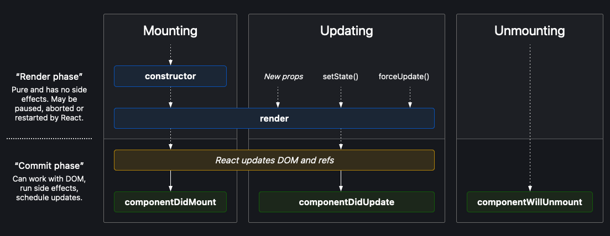
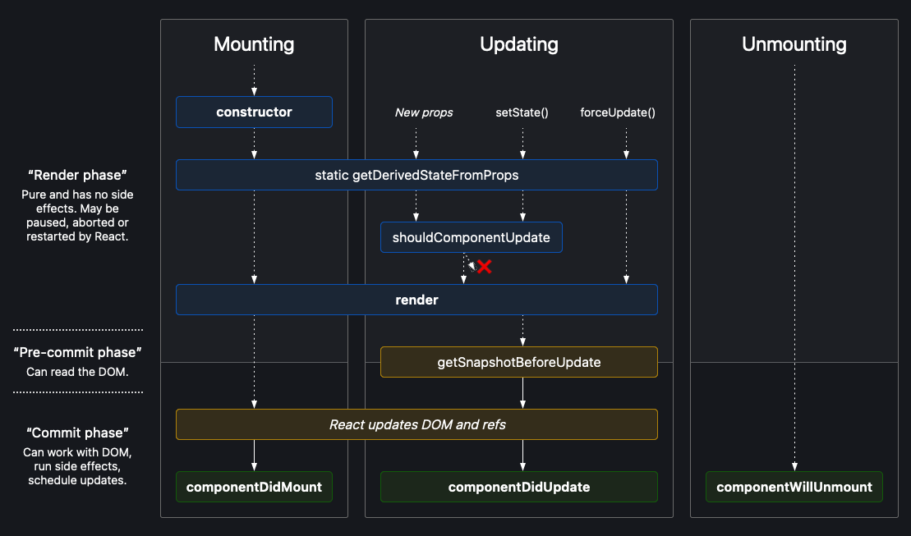

# Short Questions

This is a list of concepts or features in React.js.

## Strict Mode

It's a tool for highlighting potential problems in an application. It activates additional checks and warnings for its
descendants.

:::info

Strict mode checks are run in development mode only; _they do not impact the production build._

:::

You can enable strict mode for any part of your application. For example:

```jsx
import React from "react";

function App() {
	return (
		<div>
			<Header />
			<React.StrictMode>
				<div>
					<ComponentOne />
					<ComponentTwo />
				</div>
			</React.StrictMode>
			<Footer />
		</div>
	);
}
```

StrictMode currently helps with:

-   Identifying components with **unsafe lifecycles**
-   Warning about legacy **string ref API** usage
-   Warning about deprecated **findDOMNode** usage
-   Detecting **unexpected side effects**
-   Detecting **legacy context API**
-   Ensuring **reusable state**

## What is meant by "keep components pure"?

It means the components:

-   Shouldn't change any objects or variables that existed before rendering.
-   Return the same JSX if passed the same inputs.
-   Shouldn't depend on each other's rendering sequence.
-   Shouldn't mutate any of the inputs that are used for rendering (props, state, context). To update, use `setState` instead of mutating preexisting objects.
-   Use event handlers for "changing things". As a last resort, `useEffect` can be used.

## What is forwardRef?

lets your component expose a DOM node to parent component with a ref.

```js
const SomeComponent = React.forwardRef(render);
```

## Higher-Order Components

It's an advanced technique for reusing logic in React components.

:::info

A higher-order component is a function that takes a component and returns a new component.

```js
const EnhancedComponent = higherOrderComponent(WrappedComponent);
```

Whereas a component transforms props into UI, a higher-order component transforms a component into another component.

:::

### memo

To avoid re-rendering a component if the props remain the same, the component can be wrapped with `React.memo()`.

:::info

`React.memo()` only checks for prop changes. If your function component wrapped in `React.memo()` has a `useState`,
`useReducer` or `useContext` hook in its implementation, it will still re-render when state or context change.

:::

import CodeSandboxEmbed from "../../../src/components/CodeSandboxEmbed";

<CodeSandboxEmbed
	title="React.memo Example"
	embedUrl="https://codesandbox.io/embed/react-example-memo-vqf4qd?expanddevtools=1&fontsize=14&hidenavigation=1&theme=dark"
/>

:::info

Using `MemoedSwatch` instead of `Swatch` avoids re-rendering when "Re-Render App" button is clicked, because the prop accepted by the `Swatch` component is color which hasn't changed.

:::

If the props have any non-primitive fields (i.e. an array or object), we need to provide a function as a second argument.

```js
const MemoedSwatch = memo(Swatch, (prevProps, nextProps) => {
	// here we compare the values
	return prevProps.params.color === nextProps.params.color;
});
```

:::info
**Memoization** is only a performance optimization, not a guarantee. That is, React may still re-render the component.
:::

### lazy

It lets you defer loading component's code until it is rendered for the first time.

```js
const SomeComponent = lazy(load);
```

To defer loading a component (usually imported like `import MarkdownPreview from './MarkdownPreview.js';`), we can write it as:

```js
import { lazy } from "react";

const MarkdownPreview = lazy(() => import("./MarkdownPreview.js"));
```

:::note
This code relies on [dynamic `import()`](https://developer.mozilla.org/en-US/docs/Web/JavaScript/Reference/Operators/import), which might require support from your bundler or framework.
:::

Now that your component's code loads on demand, you also need to specify what should be displayed while it is loading. You can do this by wrapping the lazy component or any of its parents into a `<Suspense>` boundary:

```jsx
// highlight-next-line
<Suspense fallback={<Loading />}>
	<h2>Preview</h2>
	<MarkdownPreview />
	// highlight-next-line
</Suspense>
```

## Hooks

Functions starting with use are called Hooks. `useState` is a built-in Hook provided by React.

You can also write your own Hooks by combining the existing ones.

### useState

It lets you add a state variable to your component.

:::info

```js
const [state, setState] = useState(initialState);
```

**Parameters**

-   `initialState`: The initial **value** of the state, or an initializer **function** (pure, takes no arguments, and returns the initial state). This argument is ignored after the initial render.

**Returns**

It returns an array with exactly two values:

1. The current `state`. During the first render, it will match the initialState you have passed.
2. The `set` function that lets you update the state to a different value and trigger a re-render.

:::

<CodeSandboxEmbed
	embedUrl="https://codesandbox.io/embed/react-usestate-example-oq0i1d?expanddevtools=1&fontsize=14&hidenavigation=1&theme=dark"
	title="React.useState Example"
/>

In the above code, when we replace the `useState` line with the following, the `initializeCount()` will be called on each
render. This might not be desired if our initialization is somewhat expensive.

```js
const [count, setCount] = useState(initializeCount());
```

:::caution While mutating state can work in some
cases, but it isn't recommended. You should treat the state value you have access to in a render as read-only.

```js
const [position, setPosition] = useState({ x: 0, y: 0 });

function updatePosition(e) {
	// 🔴 Don't: Mutate state
	// highlight-start
	position.x = e.clientX;
	position.y = e.clientY;
	// highlight-end

	// ✅ Do: Use the set function to update state
	// highlight-next-line
	setPosition({ x: e.clientX, y: e.clientY });
}
```

:::

:::info

`setState(nextState)`

**Parameters**

-   `nextState`: A new state value or an updater function (pure, takes the pending state as argument, and returns the next state)

**Returns**

Nothing.
:::

<CodeSandboxEmbed
	embedUrl="https://codesandbox.io/embed/react-usestate-example-setstate-with-function-argument-ks40xl?fontsize=14&hidenavigation=1&theme=dark"
	title="React.useState  Example - setState with function argument"
/>

### useContext

It lets you read and subscribe to context from your component.

```js
const value = useContext(SomeContext);
```

### useReducer

It lets you add a reducer to your component.

:::info

```js
const [state, dispatch] = useReducer(reducer, initialArg, init);
```

**Parameters**

-   `reducer`: A pure function that takes `state` and `type` as arguments, and returns the updated `state`.
-   `initialArg`: If the next argument is not provided, this is the initial state, otherwise this will be passed as an argument to the `init` function.
-   `init` (optional): If provided, `initialArg` will be passed to this function for creating the initial state.

**Returns**

It returns an array with exactly two values:

1. The current `state`. During the first render, it's set to init(initialArg) or initialArg (if there's no init).
2. The `dispatch` function that lets you update the state to a different value and trigger a re-render.

:::

<CodeSandboxEmbed
	embedUrl="https://codesandbox.io/embed/react-usereducer-example-ekb0iy?fontsize=14&hidenavigation=1&theme=dark"
	title="React.useReducer Example"
/>

### useImperativeHandle

It lets you customize the handle exposed as a ref.

```js
useImperativeHandle(
	ref,
	() => {
		return {
			// ... your methods ...
		};
	},
	[]
);
```

### useMemo

It caches a calculation result between re-renders until its dependencies have changed since last time.

```js
const memoizedValue = useMemo(() => computeExpensiveValue(a, b), [a, b]);
```

<CodeSandboxEmbed
	embedUrl="https://codesandbox.io/embed/react-example-usememo-4dmg36?expanddevtools=1&fontsize=14&hidenavigation=1&theme=dark"
	title="React.useMemo Example"
/>

:::note How to tell if a calculation is expensive

In general, unless you're creating or looping over thousands of objects, it's probably not expensive.

Log the time spent performing the computation in question. If the ologged time adds up to a significant amount (say, 1ms or more), it might make sense to memoize that calculation.

```js
console.time("filter array");
const visibleTodos = getFilteredTodos(todos, filter);
console.timeEnd("filter array");
```

:::
:::tip
`useMemo` won't make the _first_ render faster. It only helps you skip unnecessary work on updates.
:::

### useCallback

It lets you cache a function definition between re-renders.

<CodeSandboxEmbed
	embedUrl="https://codesandbox.io/embed/react-usecallback-example-5w2qbv?expanddevtools=1&fontsize=14&hidenavigation=1&theme=dark"
	title="React.useCallback Example"
/>

## Custom Hooks

To share logic between function components, we can create custom hooks.

1. They are functions which start with "use" (e.g. `useState`)
2. They can make use of other React Hooks.

:::info
Extracting a custom Hook makes the data flow explicit, and code cleaner.

Ideally, with time, most of your app's Effects will be in custom Hooks.
:::

<CodeSandboxEmbed
	embedUrl="https://codesandbox.io/embed/react-custom-hook-example-55nlqu?fontsize=14&hidenavigation=1&theme=dark"
	title="React Custom Hook Example"
/>

## Class Component specific

### PureComponent

`React.PureComponent` is similar to `React.Component`, the difference is that it implements `shouldComponentUpdate()` with a shallow prop and state comparison.

:::tip
If your React component's `render` renders the same result given the same props and state, you can use `React.PureComponent` for a performance boost in some cases.
:::

### setState()

It enqueues changes to the component state and tells React that this component and its children need to be re-rendered with the updated state.

:::tip
Think of `setState()` as a request rather than an immediate command. For better perceived performance, React may delay it, and then update several components in a single pass.
:::

:::info

```js
setState(updater, callback);
```

**Parameters**

-   `updater`: The new state or a function (takes state and props as arguments)
-   `callback` (optional): It will be executed once `setState` is completed and the component is re-rendered. Generally, `componentDidUpdate()` is recommended for such logic.

:::

<CodeSandboxEmbed
	embedUrl="https://codesandbox.io/embed/peaceful-mahavira-3whzw0?fontsize=14&hidenavigation=1&theme=dark"
	title="React.Component this.setState() Example"
/>

If pass value to `this.setState` like below, the value of count will be incremented by 1 (instead of 2) when the button is clicked.

```js
this.setState(state.count + 1);
this.setState(state.count + 1);
```

### shouldComponentUpdate()

Use `shouldComponentUpdate()` to let React know if a component's output is not affected by the current change in state or props.

:::info
The default behavior is to re-render on every state change
:::

:::tip
This method only exists as a **performance optimization**. Do not rely on it to "prevent" a rendering, as this can lead to bugs. Consider using the built-in `PureComponent` instead of writing `shouldComponentUpdate()` by hand.

`PureComponent` performs a shallow comparison of props and state, and reduces the chance that you'll skip a necessary update.
:::

:::warning Not Recommended
Doing deep equality check or using `JSON.stringify()` in `shouldComponentUpdate()` is very inefficient and will harm performance.
:::

## Lifecycle Diagram

### Common methods only



### Less common methods


