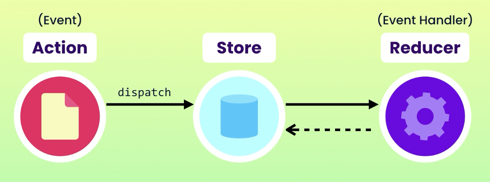

# Redux

A JavaScript library for managing and centralizing application state.

## Building Blocks

In Redux, we have 3 building blocks:

-   [Actions](#actions)
-   [Store](#store)
-   [Reducers](#reducers)

### Actions

They are plain JavaScript objects which describe **what** happened.

Redux requires an action to have a "type". Our action can optionally contain more information if we need to.

```json
{
	"type": "bugRemoved",
	"payload": {
		"id": 1
	}
}
```

### Store

It's an object that contain functions and other objects. This is the "single source of truth" and so it stores the
application state.

### Reducers

They describe **how** the app state changes.

```js
let lastId = 0;

function reducer(state = [], action) {
	switch (action.type) {
		case "bugAdded":
			return [
				...state,
				{
					id: ++lastId,
					descrption: action.payload.descrption,
					resolved: false
				}
			];
		case "bugRemoved":
			return state.filter(bug => bug.id !== action.payload.id);
		default:
			return state;
	}
}
```

## Command Flow


